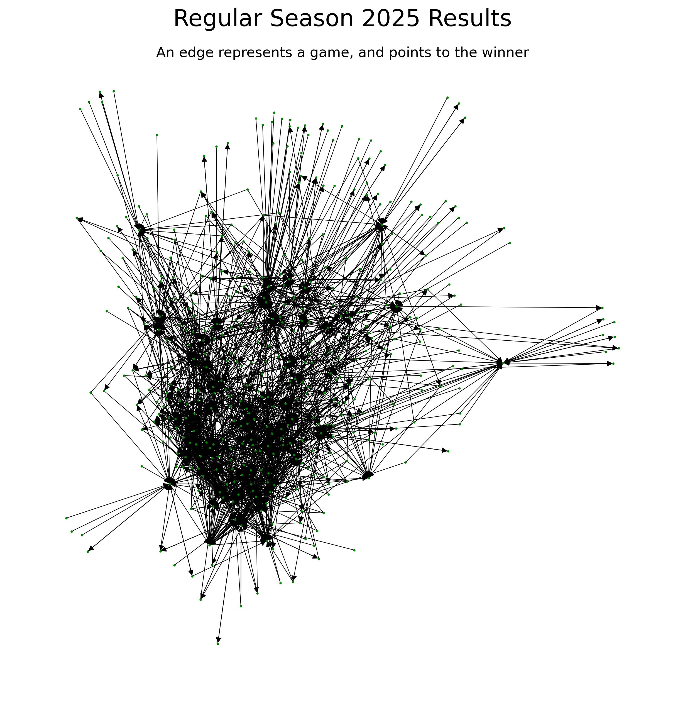
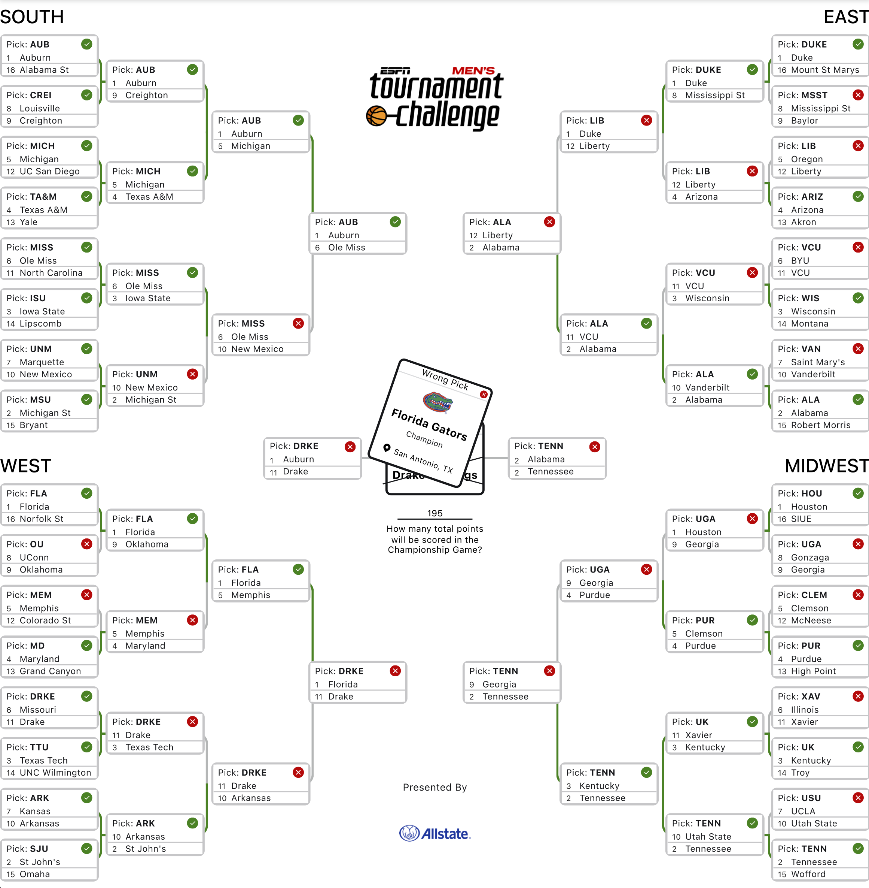

# March Madness 2025
## A naive implementation of pagerank to predict the outcomes of the 2025 march madness tournament

This repository contains code to scrape (according to usage rules) sports-reference.com to retrieve the results of a given season, create a directed graph representing those results, then performing the pagerank algorithm to rank the teams.

The results, stored by team in scripts/results and in total in scripts/results/all_games.csv, are represented by the following graph. The only games in the network, and therefore the only games that factor towards the rankings, are games played by tournament teams during the regular season.



Using the Teamranker.versus() method, I filled out my 2025 bracket according to these rankings, with the following results. 



Unfortunately, I had a bug when creating the above network that I did not fix until after March Madness had already ended. For reasons I do not fully understand, sports-reference.com sometimes lists 'opponent' as a placeholder name when the actual team is not known. Because I did not catch that and did not remove the games where opponent is listed, 'opponent' is a composite team in the network with tons of wins and losses. Although I have not done a full analysis, my hypothesis is that some great teams lost to 'opponent' and Drake won a few games against 'opponent', falsely inflating Drake's ranking. Once I removed 'opponent', the rankings perform much better, even correctly predicting Florida as the winner of the tournament.

## Project Structure
```
MarchMadness25/
├── scripts/
│   ├── main.py
│   ├── scraper.py
│   ├── rank.py
│   ├── teams.txt
│   └── results/
├── images/
│   ├── game_graph.png
│   └── bracket_results.png
├── teams.txt
└── README.md
```

## Setup and Usage
Paste the following commands into your terminal to clone this repository, create a virtual environment and install dependencies, and run the main script.

```bash
# Clone the repository
git clone https://github.com/jackson/MarchMadness25.git
cd MarchMadness25

# Create and activate virtual environment
python3 -m venv venv
source venv/bin/activate  # On Windows, use: venv\Scripts\activate

# Install dependencies
pip install -r requirements.txt

# Run the scraper and ranker
cd scripts
python3 main.py
```

## Command Line Arguments
The script accepts the following command line arguments:

```bash
# Use default settings (teams.txt and year 2025)
python3 main.py

# Specify a different teams file
python3 main.py --teams-file other_teams.txt

# Specify a different year
python3 main.py --year 2025

# Specify both
python3 main.py --teams-file other_teams.txt --year 2024
```

| Argument | Description | Default |
|----------|-------------|---------|
| `--teams-file` | Path to file containing team names | `teams.txt` |
| `--year` | Year to scrape data for | `2025` |

## Dependencies
- pandas
- networkx
- beautifulsoup4
- requests

## Next Steps
I am already brainstorming for new, more sophisticated models for next year. I am thinking of tweaking [this method](https://www.researchgate.net/publication/276069262_Ranking_NCAA_Basketball_Teams_Using_the_Google_PageRank_Algorithm) from Joe Stanek, or abandoning a network-based approach in favor of a different model. I think that a weakness of the naive pagerank implementation is that it gives a static ranked list of teams, when in reality a team's strengths and weaknesses may cause them them to beat one team while losing to a second team that the first team beat. A better match-up model is required.

Also, as previously mentioned, I only include games played by tournament teams during the regular season. This leaves out valuable information that would contribute to better rankings. For 2026, I plan to include every regular season game in the training data.

Until then, I will be adding methods to Teamranker that take in the rankings, the match-ups of the initial round, and the true results of the tournament in order to evaluate rankings. The first question I have is how well my now-fixed ranking method would have performed. Beyond that, I'd like to evaluate my rankings on previous years and learn the ideal epsilon value for the PageRank model. I would also use this method to evaulate future models.

I will also be making main.py more modular and customizable by including more command line arguments.

## Contributing
Feel free to open issues or submit pull requests if you have suggestions for improvements.

## License
This project is licensed under the MIT License - see the LICENSE file for details.

## Author
Jackson Pond
